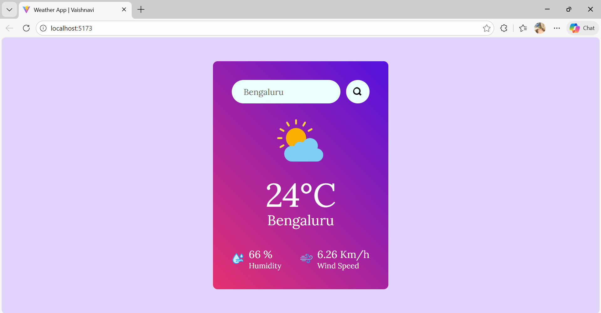

# 🌦️ Weather App

A simple and responsive **Weather Application** built using **React + Vite** that allows users to search for real-time weather information of any city using the **OpenWeather API**.

This project demonstrates API integration, state management, and clean UI design in React.

---

## 🚀 Features

- 🔍 Search weather by city name
- 🌡️ Real-time temperature (°C)
- 💧 Humidity and 🌬️ wind speed
- 🌤️ Dynamic weather icons based on conditions
- ⚡ Fast performance using Vite
- 📱 Responsive UI

---

## 🛠️ Tech Stack

- **Frontend:** React, Vite
- **Styling:** CSS
- **API:** OpenWeather API
- **Version Control:** Git & GitHub

---

## 📸 Screenshots

### 🌤️ Default City Weather


### 🔍 Search Weather by City


---

## ⚙️ Installation & Setup

Follow these steps to run the project locally:

### 1️⃣ Clone the repository

git clone https://github.com/Vaishnavi10706/Weather-App.git

### 2️⃣ Navigate to the project folder
cd Weather-App 

### 3️⃣ Install dependencies
npm install

### 4️⃣ Create a .env file in the root directory
VITE_APP_ID=your_openweather_api_key

### 5️⃣ Start the development server
npm run dev

## 🔐 Environment Variables
| Variable Name | Description         |
| ------------- | ------------------- |
| `VITE_APP_ID` | OpenWeather API key |

## 📌 Folder Structure
```
Weather-App/
├── screenshots/
│   ├── screenshot1.png
│   └── screenshot2.png
├── src/
│   ├── assets/
│   ├── MyComponents/
│   ├── App.jsx
│   ├── main.jsx
│   └── index.css
├── .env
├── README.md
├── package.json
└── vite.config.js
```

## 🔮 Future Improvements

🎨 UI/UX enhancements

🚀 Deployment on Vercel or Netlify

⏳ Loading spinner and improved error handling

## 👩‍💻 Author

Vaishnavi
GitHub: Vaishnavi10706

⭐ If you like this project, consider giving it a star!
